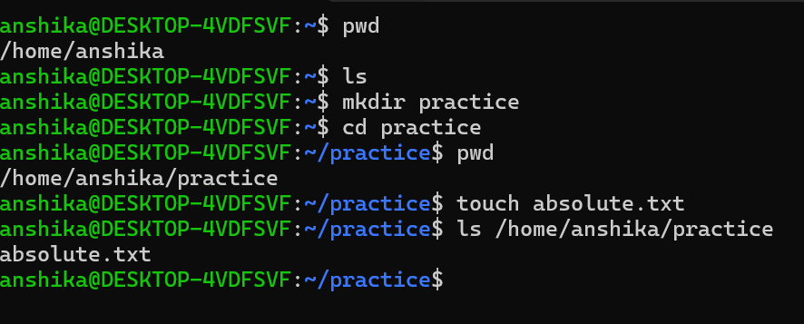
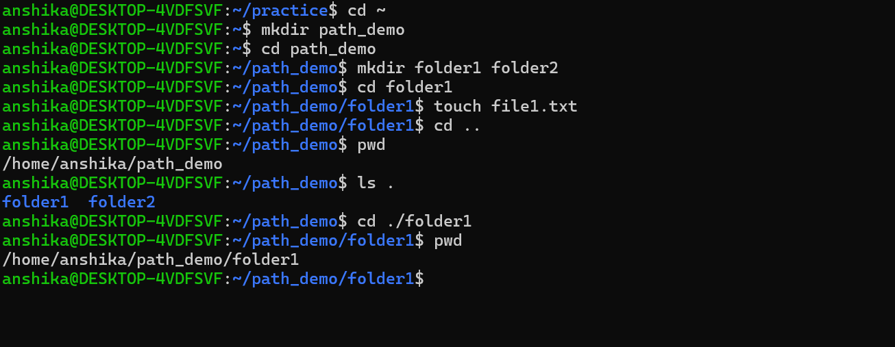

## Path in Linux
A path tells Linux where a particular file or directory is located.

## Types of Paths
I learned about two main types of paths:
1. Absolute Path
     -  starts from the root directory "/".
     -  It gives complete location of the file or directory.
   ### Syntax
         - /parent_directory/subdirectory/file_or_directory
2. Relative Path
     - A relative path describes a location from the current directory.
     - It does not start with / rather depends on your current location pwd)
   ### Syntax
          - directory/file

## Important Path Symbols

|Symbol| Meaning| Command|
|----|----|----|
|"/"| Root directory| cd / |
|"."| Current directory| ls . |
|".."| Parent directory| cd .. |
|"~"| User's home directory i.e personal directory assigned to linux user| cd ~ |

## Commands Practiced
I practiced the above mentioned commands in Ubuntu for which I have attached the screenshot

 # What I learned
    - I used "pwd" to check my current location and practiced moving between directories using relative paths.
    - The practical helped me understand how paths are used for navigation and working with files and directories in Linux.

