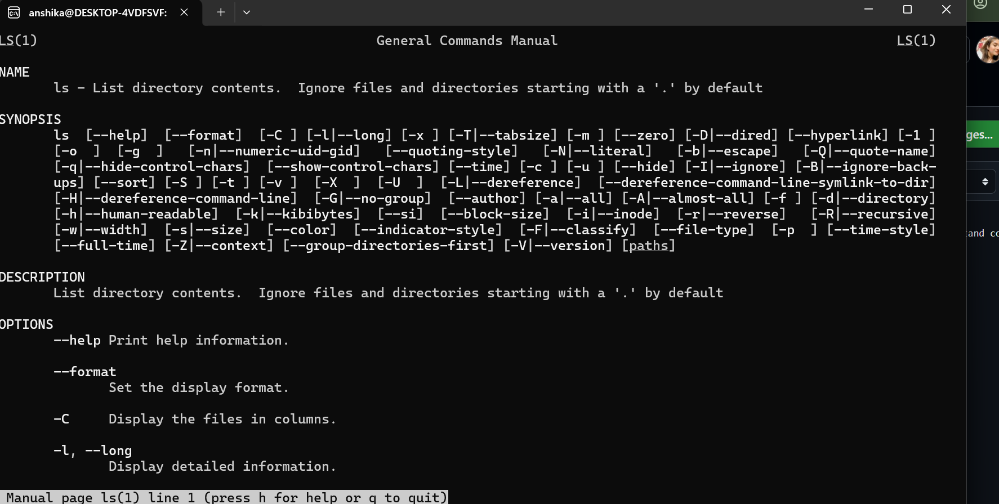
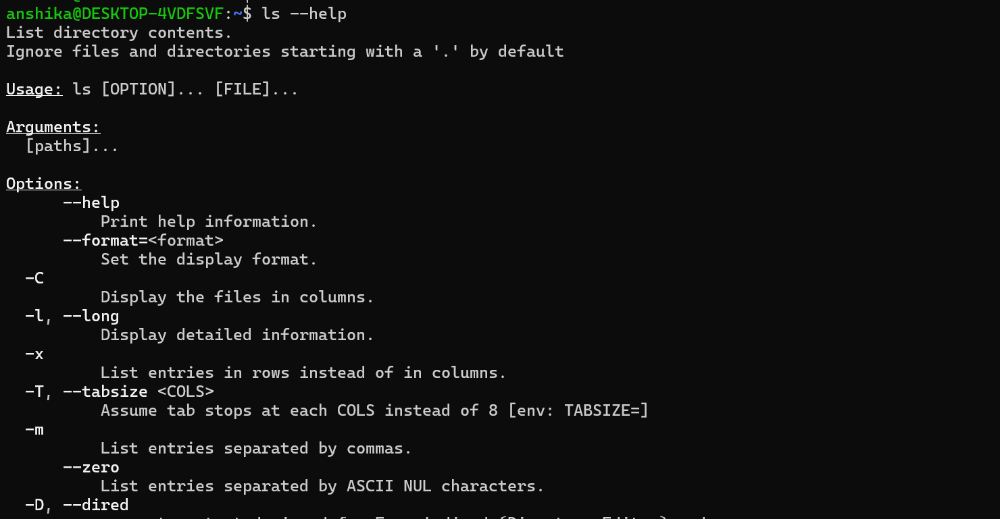

## Why Command Help Is Useful
- Linux has many commands and options, so it is not necessary to memorize everything. Built-in help allows users to understand commands and check their available options directly from the terminal.

# Commands Covered
|Command| Purpose|
|----|----|
|"man <command>"| Opens the detailed manual page for a command|
|"<command> --help"| Displays a quick help summary and available options|

# Practical Evidence
- Screenshots included in this section show the use of:
    - "ls --help"
    - "man ls"

1. Man command- When I wrote ls man the below mentioned result was displayed.
   

2. Help command- The below mentioned screenshot displays the command and its result

# What I Learned
- How to use "--help" for quick command information.
- How to use "man" for detailed command documentation.
- How to exit a manual page using "q".
- How built-in documentation can help me learn and use Linux commands independently.
