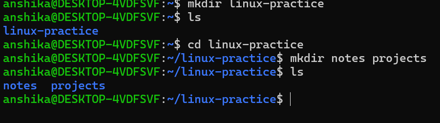
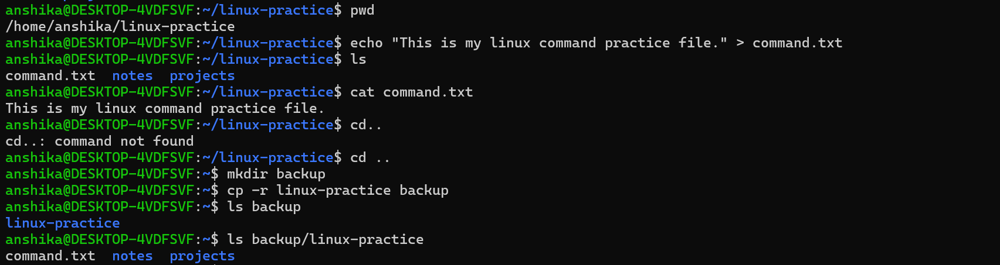
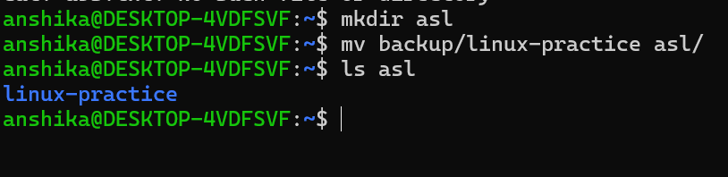
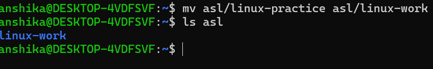
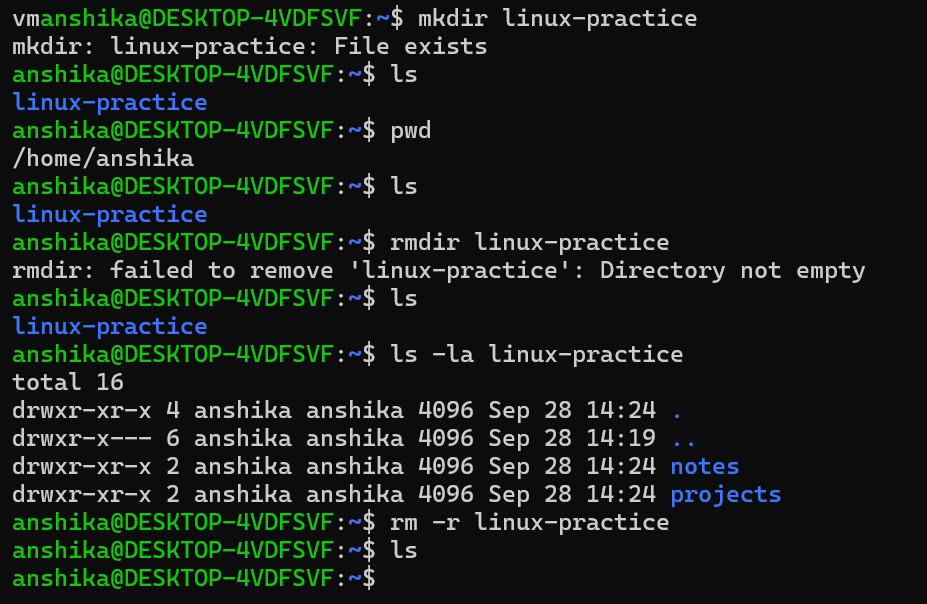

## Directory
 - It's a location used to organize and store files and other directories.
 - It is similar to a folder in Windows.

## Commands Learned

Command| Purpose|
|----|----|
|"mkdir"| Creates a new directory|
|"rmdir"| Removes an empty directory|
|"touch"| Creates a new empty file|
|"cp"| Copies a file or directory|
|"mv"| Moves or renames a file or directory|
|"rm"| Removes a file|
|"cat"| Displays the contents of a file|

---

# Creating directory
- The "mkdir" command is used to create a new directory in Linux.
- "mkdir" stands for make directory.
    - Syntax:
           mkdir directory_name
           ls
      
## Practical Activity

I created a practice directory and performed different file management operations.

  - I created a main directory and then created two directories inside it:
    

The "ls" command displayed "notes" and "projects", confirming that the directories were created successfully.

  - Created, viewed and copied a text file too
  - I also used "echo" to put some text into a file for practical testing.

        - echo "This is my linux command practice file." > command.txt
      - Then I viewed the content using cat command

 
 

  - Moved the copied directory into new directory

 - Renamed the directory

 - Used the command "rmdir" and "rm -r"

# What I Learned

- I learned what a directory is and how directories are organized in Linux. I also practiced creating directories using the "mkdir" command and verified their creation using the "ls" command.
- - I learned how files and directories can be managed through the Linux terminal.
- I learned the difference between creating a directory and creating a file.
- I practiced copying and moving files.
- I learned that "mv" can also be used to rename files.
- I practiced viewing file contents using "cat".
- I learned how to remove files and empty directories.
- I understood that Linux provides command-line tools for performing everyday file management tasks.

---

# Tools Used

- Ubuntu Linux
- Linux Terminal
- Basic Linux command-line utilities

     
