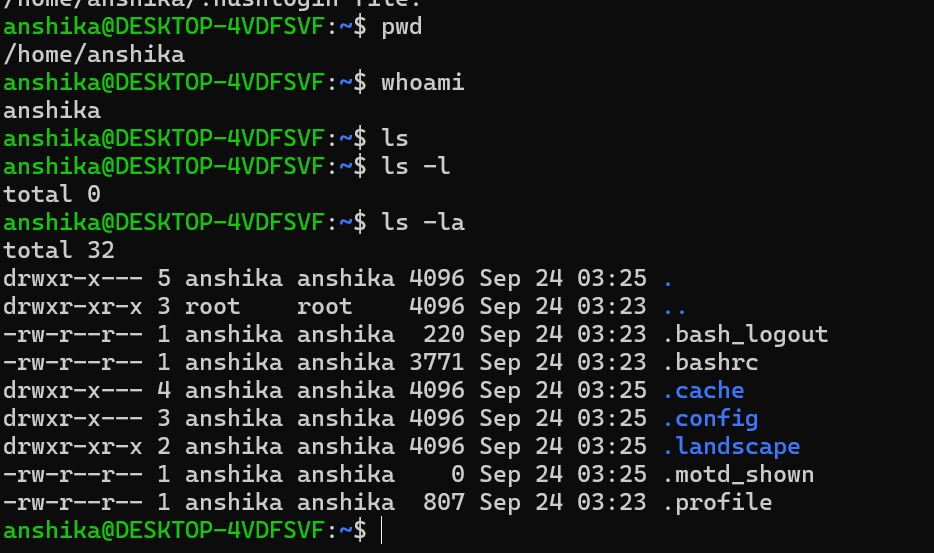
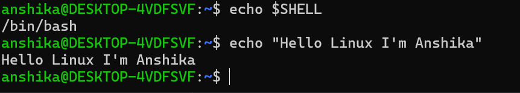

## Linux
 - Linux is an open-source operating system kernel.
 - wherein kernel is a core component while OS is the complete system
 - Linux is widely used in areas such us:
     - Servers
     - Cloud computing
     - Networking
     - System administrator
     - cybersecuirty

  # Linux Distribution
     - It combines the Linux kernel with other software to provide a complete operating system
     - It is used as the foundation for many operating systems called Linux distributions.
     - Some common Linux distributions are:
        - Ubuntu
        - Debian
        - Fedora
        - Kali Linux
        - Arch Linux

---

## Terminal
 - Text-based interface/application that allows a user to interact with the operating system by entering commands.
   # Terminal vs GUI
   |Terminal| GUI|
   |----|----|
   |Command line interface| Graphical User Interface|
   |Allows you to interact with OS by typing commands  |Allows to interact with computer using visual elements like windows, icons, buttons and menus.| 
   |requires learning commands| easier for beginners|
   |efficient for repetitive/system task| Good for visual tasks|
   |ex: ls (to list files)| ex: opening a folder in file explorer|

  # Why terminal is important in Linux and cybersecuirty?
  - It is important because many Linux administration and cybersecurity tasks are performed through commands.
  - In cybersecurity terminal is useful for:
     - System administration- managing files, users, permissions and processes
     - Networking- checking IP addresses, connection, DNS and network configuration.
     - Security tools- many cybersecurity tools like Nmap and Wireshark command line utilities can be used from terminal.
     - Troubleshooting- commands can provide detailed information about system and network.
 # Basic Terminal commands
 |Commands| Feature|
 |----|----|
 |pwd | shows the current working directory|
 |ls | list files and directories|
 |ls -l | Displays files in a detailed format|
 |ls -a | shows hidden files|
 |ls -la | shows hidden files along with detailed information|
 |clear | clears the terminal screen|
 |whoami | shows username of currently logged-in user|

 

 # shell
 - The shell interprets the commands entered by the user and communicates with the operating system.

 - Some common shells are:
     - Bash
     - Zsh
     - Fish

During my Linux practice, I am mainly working with Bash commands.

 ---

### What I practiced
I practiced checking my current directory and Linux username, listing files and directories, viewing detailed directory contents,
and identifying shell running in my Ubuntu environment.

 
    

     
