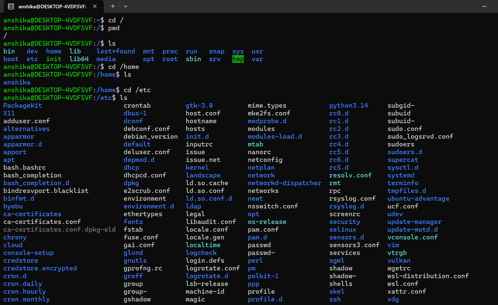
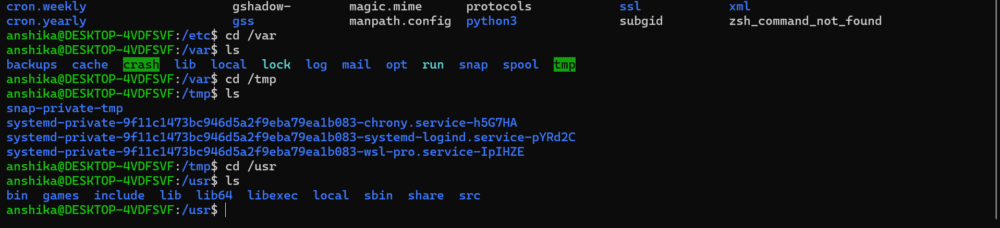

## Linux Filesystem Hierarchy
 - Linux uses a hierarchical file system to store and manage files and directories.
 - Starts from root directory: "/"
 - All files and directories are organized under/ accessible from root directory.

Unlike Windows, Linux does not normally use drive letters such as "C:" or "D:" for navigating the file system.
I learned about some important Linux directories which are as follows

|Directory| Purpose|
|----|----|
|"/"| Root directory|
|"/home"| Contains users' personal directories|
|"/root"| Home directory of the root user|
|"/etc"| Contains system configuration files|
|"/var"| Contains data that changes frequently(log files, cache, application data)|
|"/tmp"| Contains temporary files|
|"/usr"| Contains many user programs and utilities|
|"/dev"| Contains device-related files|
|"/proc"| Contains information related to processes and the system|
 
- Note:  - cd= it's a linux command used to move from one directory to other.
- 
## Linux command
|Command| Purpose|
|----|----|
|cd| used to move from one directory to other|
|pwd| prints working directory|
|ls| lists files/directories|
|ls -l| detailed listing|
|ls -la| shows hidden files+ details|
|cd / | goes to root directory|
|cd ~ | goes to home directory|

## Practical Exploration
I explored the Linux file system hierarchy using basic navigation and listing commands in Ubuntu

### Commands Practiced
 - 'cd /'
 - 'pwd'
 - 'ls'
 - 'cd /home'
 - 'cd /etc'
 - 'cd /var'
 - 'cd /tmp'
 - 'cd /usr'

### Practical Evidence
- The screenshots below show my terminal practice while exploring different directories in the Linux file system hierarchy.

- 

- 

### What I Observed
- I connected the theoretical Linux file system hierarchy with the actual directory structure in Ubuntu.
- I used 'cd', 'pwd' and 'ls' to navigate through and inspect different directories.

