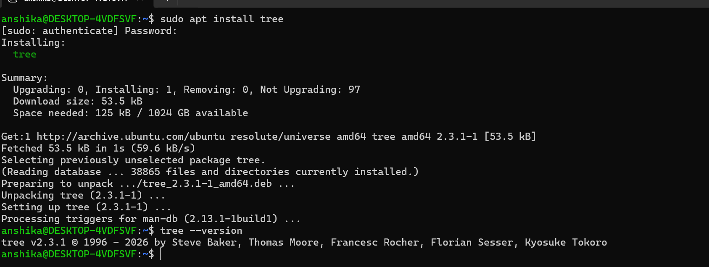
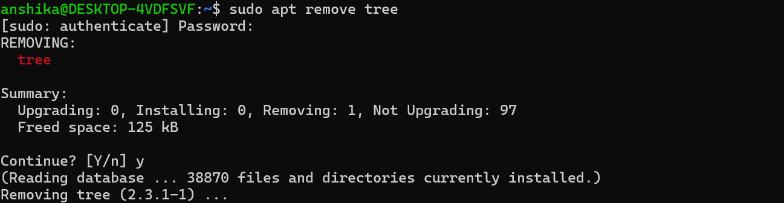

## Package
- A package is a collection of files and information required to install and run a particular software application.

 # Package Management
 - Is the process of installing, updating, upgrading, removing, and managing software packages on a Linux system.
 - Linux distributions (Ubuntu) use package managers to make software installation and maintenance easier and safer.
     # Why Package Management Matters in Cybersecurity

Package management is important in cybersecurity because security tools and system components need to be:

- Installed correctly
- Updated regularly
- Patched against known vulnerabilities
- Removed when no longer required
- Kept at trusted versions
- Managed with proper dependencies

An outdated package can contain known security vulnerabilities, so keeping packages updated is an important part of system security.

---
 # Package Repositories
 - A package repository is a storage location that contains software packages and related metadata for a Linux distribution.
 - It's like an online software library for Linux distribution.
   
 # APT (Advanced Package Tool)
 - It's an package manager.
 - Instead of manually downloading software from different websites, a package manager can use configured repositories to obtain software in a structured way.
 - It uses repositories to find, download, install, and update software packages.

#  Installing, Updating and Removing Packages

1. Installing a Package

- Linux packages can be installed using a package manager. On Ubuntu, APT is commonly used.
- Syntax
     - sudo apt install <package-name>

Example

I used the "tree" package for practice:

sudo apt install tree

Verify Installation

After installation, I verified the package using:
tree --version

      # cybersecurity Relevance
          - Installing packages is important for cybersecurity because security professionals regularly need to install tools such as:
                   - Nmap
                   - Wireshark
                   - Git
                   - other security and administration tools

          - Software should preferably be installed from trusted repositories or trusted sources.

---

2. Updating Packages

- Keeping installed software updated is an important part of Linux system security.
- There are two important commands:
    - Step 1 — Update Package Information
         - sudo apt update
    - It helps the system identify newer versions of available packages.

    - Step 2 — Upgrade Installed Packages
        - sudo apt upgrade
    - This installs available upgrades for installed packages.

Check Available Upgrades

Before upgrading, available upgrades can be checked using:

apt list --upgradable

    # Cybersecurity Relevance

       - Regular software updates can provide:
                - Security patches
                - Bug fixes
                - Stability improvements
                - Updated dependencies
                - Protection against known vulnerabilities

     - Running outdated software can increase the risk of exploitation when vulnerabilities are publicly known.

---

3. Removing a Package

- Packages that are no longer required can be removed.
-  Syntax
     - sudo apt remove <package-name>

## Command Summary

Command| Purpose|
|----|----|
|"sudo apt install <package>"| Install a package|
|"apt search <package>"| Search for a package|
|"apt show <package>"| View package information|
|"tree --version"| Verify installed software|
|"sudo apt update"| Refresh package information|
|"apt list --upgradable"| Check available upgrades|
|"sudo apt upgrade"| Upgrade installed packages|
|"sudo apt remove <package>"| Remove a package|
|"sudo apt purge <package>"| Remove package and configuration files|
|"sudo apt autoremove"| Remove unnecessary dependencies|

## Cybersecurity Takeaway (My Learning)

Package management is an important Linux administration and cybersecurity skill.

I learned that:

- Software can be installed using trusted package repositories.
- Package information should be updated regularly.
- Installed packages should be kept updated.
- Unnecessary software should be removed.
- Package versions and dependencies are important when maintaining system security.
- Keeping software updated helps reduce exposure to known vulnerabilities.

---

