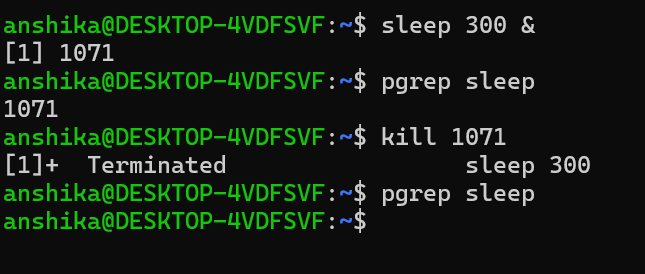
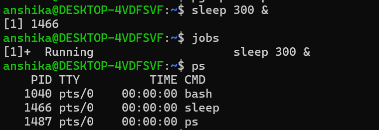
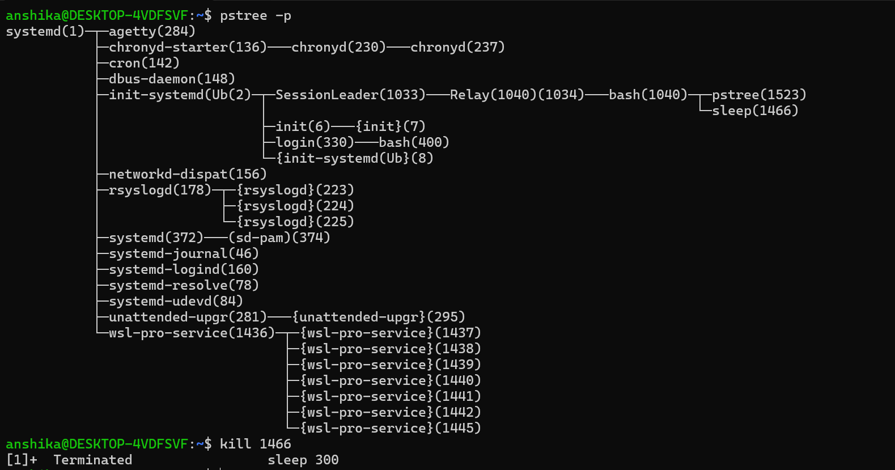

## Process
- It is a program that is currently running.
- Whenever a program or command is executed, Linux creates a process to manage its execution.
- Each process has its own Process ID (PID) and uses system resources such as CPU and memory.

## Program VS Process
| Program | Process |
|---|---|
| Stored set of instructions | Running instance of a program |
| Passive | Active |
| Does not need CPU time until executed | It uses CPU time, memory, and other resources. |
| Can exist without running | Exists while the program is executing |
| One program can create multiple processes | Each process has its own execution state and resources |
| Example: chrome.exe stored on your computer | Example: a running instance of Chrome|

---

## Process ID(PID)
- It is a unique number assigned by Linux to each running process.
- Operating system uses PID to identify a particular process.
- Ex: chrome = PID 101  VS CODE = PID 102

## Parent and child processes
- Parent process- The process that creates another process.
- Child process- Process created by child.
- Linux uses a parent-child relationship to manage processes.

## PPID (Parent Process ID)
- It identifies the PID of parent process that created a particular process.

## Foreground vs Background
- In Linux, processes can run either in the foreground or background.

| Features| Foreground Process| Background Process|
|----|----|----|
| Control| Controlled directly by the terminal| Runs independently while terminal is available|
| Terminal| Occupies the terminal| Does not occupy the terminal|
| User input| Can receive input from terminal| Normally cannot receive terminal input|
| Next command| Usually cannot enter another command until it finishes| You can continue using the terminal|
| Example| `nano file.txt`| `nano file.txt &'|

## Process State
- A process state tells us what a process is currently doing in the Linux operating system.
   # Main Linux process states
| State| Symbol| Meaning|                                                                       
|----|----|----|
| **Running**  | `R` | Process is currently executing or is ready to execute|
| **Sleeping** | `S` | Process is waiting for an event/resource|
| **Stopped**  | `T` | Process has been stopped, usually by a signal `Ctrl+Z`|
| **Zombie**   | `Z` | Process has finished, but its parent has not yet collected its exit status|

## Process Monitoring
- Process monitoring means observing and managing the processes running in a Linux system.
- helps us check CPU usage, memory usage, process states, process IDs, and whether a process is consuming too many resources.
  # commands
|Commands| Purpose| Cybersecurity relevance|
|----|----|----|
| ps| displays currently running processes.| basic process investigation|
| ps aux| displays detailed information about running processes| helps to identify suspicious process|
| top| Real-time process monitoring| helps to detect CPU/RAM usage|
| pstree| displays processes in a tree structure | helps us to understand how processes started|
| pgrep <name>| finds a process by name| quickly locates a specific process|
| fg| brings background jobs to foreground| shell/process management|
| bg| runs a stopped job in background| shell/process management|
| &| starts a command in background| helps to run processes without blocking terminal|
| kill <PID>| terminates process| safely stops process|
| Kill -9<PID>| forcefully terminates| useful when process refuses to terminate|

  # CPU/Memory Usage
  - Processes use system resources such as CPU and memory while they are running.
     # CPU Usage
        - CPU usage shows how much of the processor's capacity a process is currently using.
     # Memory Usage
        - Memory usage shows how much RAM a process is using while it is running.
     # Checking CPU and Memory Usage
         - top command
         - ps aux command
     # What I learned
         - CPU usage shows how much processor resources a process is using, while memory usage shows how much RAM it is using.
         - Commands such as top and ps aux can be used to monitor these resources.
  # Terminating Process
  - Linux provides the kill command to send a signal to a process using its PID.
  - Syntax: kill PID

## Practicing Process Termination Safely
- For practice, I created my own process using the sleep command.
- I found its PID using:
pgrep sleep
- Then I terminated the process using:
kill PID
- After terminating it, I verified whether it is still running:
pgrep sleep
- I also practiced some of the above mentioned commands like jobs, ps, pstree.

  
    
