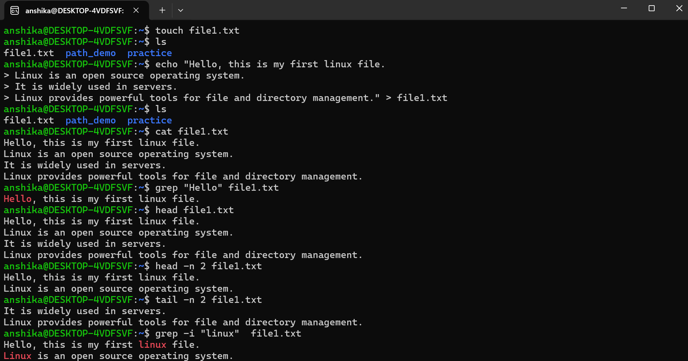

## Objective
- In this practice, I learned how to read the contents of files and search for specific text using Linux terminal commands.

## Commands Covered
|Command| Purpose|
|----|----|
|"cat"| Displays the complete contents of a file|
|"less"| Reads a file page by page|
|"head"| Displays the beginning of a file|
|"tail"| Displays the end of a file|
|"grep"| Searches for specific text inside a file|
|"grep -i"| Searches without considering uppercase/lowercase|
|"grep -n"| Displays matching lines with line numbers|

## Practical
- I created a text file within my directory using "touch" command 
- Added some text within that file using echo and viewed it's content through "cat" command.
- I searched for specific text(hello) through "grep" command
- Read first 2 lines of the file with the help of "head" command
- Read last 2 lines through "tail" command
- I also did case sensitive search through "grep-i" command

  # Practical Evidence
     - Screenshots included in this folder show the execution and output of the commands practiced.
  

