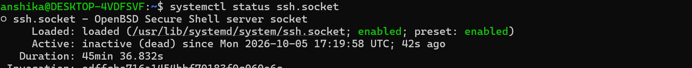
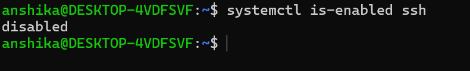

## Linux Services
- A service is a background program that performs a specific task without requiring continuous interaction from the user.
- Services can start automatically when the system boots and continue running in the background.
  
- Examples of services include:
- SSH service
- Network services
- Web servers
- Cron services
- System logging services
Linux uses systemd to manage services.

---
  # systemd
  - Is the service and system manager.
  - It is responsible for:
       - Starting services during boot
       - Stopping services
       - Restarting services
       - Checking service status
       - Managing services in the background
  - The main command used to interact with systemd is:

systemctl

---
 # Starting a Service

A service can be started using:

sudo systemctl start <service-name>

- I started the service ssh and checked whether it's active(running) or not.

This starts the service immediately.

---
 # Checking Service Status

To check whether a service is running:

systemctl status <service-name>

- for the reference I have attached the screenshot of the service that I practiced
  

What I observed:
I checked the current status of the SSH service and observed whether it was active/running.

---
 # Listing Running Services

To view currently active services:

systemctl list-units --type=service --state=running

- 

What I observed:
I viewed the services currently running in the Linux system.

---
 
 # Stopping a Service

A running service can be stopped using:

sudo systemctl stop <service-name>

Example:

sudo systemctl stop ssh

- This stops the service immediately. Also in the below screenshot I also practiced how to shut the socket too, which is basically a listener that activates the service when a connection arrives.
- I also checked whether the ssh.socket is stopped or not
   
 
---
 # Restarting a Service

A service can be restarted using:

sudo systemctl restart <service-name>

Example:

sudo systemctl restart ssh

 # Disabling the service
 - To prevent a service from starting automatically during boot:

sudo systemctl disable <service-name>

Example:

sudo systemctl disable ssh

---
 #  Checking Enabled Status
 - To check whether a service is configured to start automatically:

systemctl is-enabled <service-name>

What I observed:
I checked whether the SSH service was configured to start automatically during system boot.

---

## What I Learned

- A Linux service is a background process that performs a specific function.
- "systemd" is responsible for managing many Linux services.
- "systemctl" is used to control and inspect services.
- "systemctl status" can be used to check a service.
- "start", "stop", and "restart" control the current state of a service.
- "enable" and "disable" control whether a service starts automatically at boot.
- Checking running services is useful for Linux administration and cybersecurity.
- Understanding services helps identify potentially unnecessary or exposed components of a system.

               -  I learnt how to inspect and manage services using "systemctl" which helped me in understanding  how Linux systems operate and how unnecessary or exposed services can affect system security.
---
