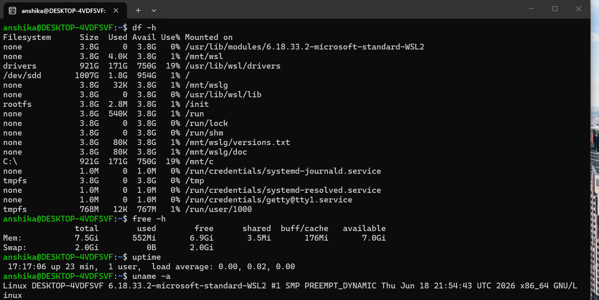

      - «Note: Detailed process monitoring was covered separately using commands such as "ps", "top", "pstree", and "pgrep". This file focuses on system-level monitoring and resource usage.»

---

## System Monitoring:
System monitoring helps a user observe:-
- CPU usage
- Memory usage
- Disk usage
- Running processes
- Basic system information

#  CPU Usage

CPU usage shows how much of the processor is currently being used by the system and its applications.
High CPU usage can be caused by:
- Background processes
- System tasks
- A malfunctioning process
- In some cases, suspicious or malicious activity
   Command :top
  
   # Cybersecurity Relevance
       Unexpectedly high CPU usage can be a reason to investigate which process is consuming the resources.

---

# Memory Usage

Memory (RAM) is used by the operating system and running applications.
Monitoring memory helps determine how much RAM is:
- Used
- Free
- Available
- Allocated to buffers/cache

Command: free -h

 # Cybersecurity Relevance
     Unexpectedly high memory usage may require investigation of the applications or processes using the memory.

---

#  Disk Usage

Disk monitoring shows how much storage space is being used and how much remains available.
A system with insufficient disk space may experience:
- Application failures
- Logging problems
- System performance issues

Command: df -h  

 # Cybersecurity Relevance

    - Unexpectedly high disk usage can sometimes be associated with:

       - Excessive log generation
       - Large unwanted files
       - Malware-generated files
       - Unusual file activity

    - Disk usage alone does not prove malicious activity and should be investigated further.

---

# Checking Directory Size

The "du" command can be used to check how much disk space a directory occupies.

Command: du -sh <directory>

# Cybersecurity Relevance

    Checking directory sizes can help identify locations that are unexpectedly consuming large amounts of storage.

---

# Basic System Information

Basic system information helps understand the current state and configuration of a Linux system.

Check System Uptime

uptime

This displays:

- Current time
- System uptime
- Number of logged-in users
- Load average

 # Cybersecurity Relevance

    Unexpected user sessions may require investigation, especially on systems where only specific users should have access.

---

# Check Kernel and System Information

uname -a

This displays information about:

- Kernel name
- Hostname
- Kernel release
- Kernel version
- System architecture

## Evidence / Screenshots
- I practiced commands free -h, df -h, uptime, uname -a
- The following screenshots were captured as practical evidence:

 # What I Learned

- Learned how to monitor overall Linux system activity.
- Learned how to check CPU and system activity.
- Learned how to check RAM and swap usage.
- Learned how to check available disk space.
- Learned how to check the size of directories.
- Learned how to view currently running processes.
- Learned how to check logged-in users.
- Learned how to obtain basic Linux system information.
- Learned how system monitoring can support basic cybersecurity investigations.

---

 # Cybersecurity Takeaway

System monitoring provides visibility into the current state of a Linux system.

Understanding CPU, memory, disk usage, processes, users, and system information provides a foundation for later cybersecurity topics such as:

- Log Analysis
- Incident Response
- Threat Detection
- Malware Investigation
- Security Monitoring
- SIEM / SOC Operations

---

